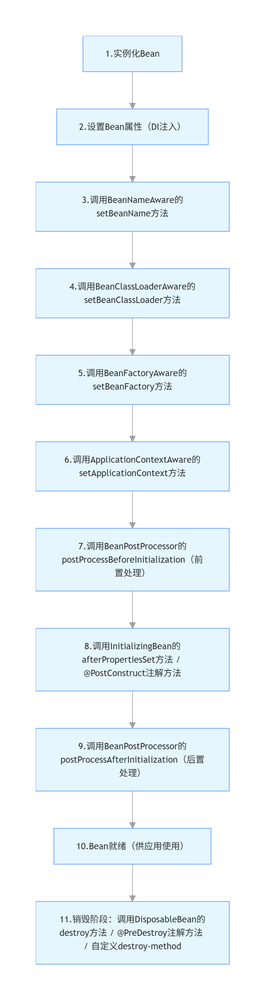

### 1. 什么是 Spring？
Spring 是一个 轻量级 IOC + AOP 容器，核心目标是：
- 解耦
- 提高可维护性

---

### 2. 什么是 IOC？什么是 DI？
- IOC（控制反转） 是一种设计思想，核心是：将对象的创建、管理、依赖关系的维护等 “控制权”，从应用程序代码本身转移到第三方容器（如 Spring IOC 容器）
- DI（依赖注入） 是 “落地手段”，核心是容器在创建对象时，自动将依赖注入到对象中
- **核心价值**：解耦、简化开发、便于维护，是 Spring 框架的基石，几乎所有 Spring 功能（如 AOP、事务）都基于 IOC 容器实现
---

### 3. AOP是什么？ 有什么应用场景？
- AOP（Aspect-Oriented Programming）即面向切面编程，是与 OOP（面向对象编程）互补的编程思想：
> - OOP 关注 “业务逻辑的纵向划分”（如用户模块、订单模块、支付模块）；
> - AOP 关注 “横切逻辑的横向抽取”（如日志、事务、权限、性能监控等，这些逻辑横跨多个业务模块） I
- 把分散在各个业务方法中的通用逻辑（如日志记录）抽离出来，形成一个独立的 “切面”，通过 “动态织入” 的方式应用到目标方法上，实现通用逻辑与业务逻辑的解耦，避免重复代码

| 术语 | 通俗解释 |
|------|----------|
| 切面（Aspect） | 抽离出来的通用逻辑模块（如日志切面、事务切面），包含 “通知” 和 “切点” |
| 通知（Advice） | 切面的具体逻辑（如日志的 “记录入参”“记录返回值”），分 5 种类型（前置 / 后置 / 环绕 / 异常 / 最终） |
| 切点（Pointcut） | 定义切面要 “织入” 到哪些目标方法上（如所有 com.service 包下的方法） |
| 织入（Weaving） | 将切面逻辑应用到目标方法的过程（Spring 中默认是运行时织入） |
| 连接点（JoinPoint） | 程序执行过程中可被切面拦截的点（如方法调用、异常抛出），切点是连接点的筛选结果 |

- **总结**
- **AOP 核心定义**：面向切面编程，抽离横切逻辑（日志、事务等）形成切面，动态织入目标方法，解耦通用逻辑与业务逻辑；
- **核心应用场景**：日志记录、事务管理、权限校验、性能监控、异常处理、缓存控制、接口限流；
- **核心价值**：避免重复代码，统一通用逻辑，提升代码可维护性和扩展性；
- **底层原理**：Spring AOP 基于动态代理（JDK/CGLIB）实现，运行时织入切面逻辑。

### 4. AOP 的核心原理（简化版，面试够用）
- Spring AOP 底层基于动态代理实现，分为两种方式：
- JDK 动态代理：目标类实现了接口时，通过生成接口的代理类来织入切面逻辑；
- CGLIB 动态代理：目标类未实现接口时，通过生成目标类的子类来织入切面逻辑。

- **核心流程**：
> - 定义切面（Aspect），指定切点（Pointcut）和通知（Advice）； 
> - 程序运行时，Spring 为目标类创建代理对象； 
> - 调用目标方法时，代理对象先执行切面的通知逻辑，再执行目标方法； 
> - 最终返回结果，完成切面的织入。

---

### 5. Spring AOP 和 AspectJ 区别？
- 本质差异：
> - Spring AOP 是 **Spring 内置的动态代理实现**，轻量级、仅支持方法级拦截、**运行期织入**、仅作用于 Spring Bean；
> - AspectJ 是**完整的 AOP 标准，静态织入**、支持所有连接点、可作用于任意类、性能更高，但使用复杂度高。
- 核心选择原则：
> - 90% 的 Spring 项目场景，用 Spring AOP 足够（方法级切面、简单易用）；
> - 若需拦截字段 / 构造器、非 Spring 类，或追求极致性能，用 AspectJ；
> - 语法复用：Spring AOP 借用 AspectJ 的注解语法（@Aspect/@Before），但底层实现无关，无需混淆。
- 简单记：Spring AOP 是 “够用就好” 的轻量级方案，AspectJ 是 “无所不能” 的专业级方案。

---

### 6. Bean 的生命周期是什么？
- 本质是Spring 容器从创建 Bean 实例开始，到 Bean 实例最终被销毁的整个过程
  

- 实例化
- 属性注入
- Aware 接口
- BeanPostProcessor
- 初始化方法
- 使用
- 销毁
---

### 7. Spring Boot 为什么能自动配置？
- **核心原理**：Spring Boot 自动配置基于 @EnableAutoConfiguration 开启总开关，通过 SPI 加载自动配置类，再通过 @Conditional 系列注解按需生效，最终实现 “按需配置、开箱即用”；
- **核心精髓**：条件注解（@Conditional）保证配置 “按需生效”，@ConditionalOnMissingBean 保证 “用户配置优先”；
- **核心价值**：消除传统 Spring 繁琐的 XML/Java 配置，简化开发，同时保留灵活的定制能力。
---

### 8. 自动配置的完整流程
- **启动触发**：Spring Boot 主类的 @SpringBootApplication 包含 @EnableAutoConfiguration，开启自动配置；
- **加载配置类**：AutoConfigurationImportSelector 通过 SPI 机制，加载 META-INF/spring/org.springframework.boot.autoconfigure.AutoConfiguration.imports 中的所有自动配置类；
- **条件筛选**：Spring 容器根据自动配置类上的 @Conditional 注解，筛选出满足条件的配置类；
- **创建 Bean**：满足条件的配置类生效，自动创建对应的 Bean 到容器中；
- **用户覆盖**：如果用户自定义了相同类型的 Bean，Spring Boot 会优先使用用户的 Bean（@ConditionalOnMissingBean）；
- **配置绑定**：自动配置类通过 @EnableConfigurationProperties 绑定配置文件中的属性，覆盖默认值。

---

### 9. Spring Boot 如何简化配置？
- Spring Boot 并非 “消除配置”，而是通过**约定大于配置、自动配置、简化配置格式、内置默认值**等核心手段，将传统 Spring 繁琐的配置简化到 “开箱即用” 的程度
  
| 核心手段          | 具体解释 | 解决的传统 Spring 痛点 |
|:--------------|:---------|:----------------------|
| 自动配置（核心）      | 基于依赖自动推断并配置 Bean（如引入 web 依赖自动配 Tomcat/MVC） | 需手动编写 XML/Java 配置定义 Bean（如 DispatcherServlet、数据源） |
| 约定大于配置        | 内置默认规则（如配置文件默认路径、Bean 扫描路径），无需手动指定 | 需手动配置扫描包、视图解析器前缀、端口号等 |
| 简化配置格式        | 支持 application.yml/yaml 简洁格式，替代繁琐的 XML/Properties | XML 配置冗余（如 <bean> 标签嵌套），Properties 格式不支持层级、易写错 |
| 起步依赖（Starter） | 一键引入场景化依赖（如 spring-boot-starter-web），自动管理依赖版本 | 需手动引入多个依赖（如 spring-web、spring-mvc、tomcat），且需手动解决版本冲突 |
| 配置绑定          | 配置文件属性自动绑定到 Java 类（@ConfigurationProperties），无需手动读取 | 需手动通过 @Value 逐个注入属性，或编写代码读取 Properties 文件 |
| 内置容器 / 组件     | 内置 Tomcat/Jetty、日志框架等，无需手动部署 / 配置 | 需手动下载、配置容器，编写日志配置文件（如 log4j.xml） |
---

### 10. Spring 事务的传播行为？

(1) REQUIRED（默认）：支持当前事务，无则新建
> - 核心逻辑：   
> **如果外层有事务，内层复用外层事务**；   
> **如果外层无事务，内层新建自己的事务**。   
> - 通俗解释：“能复用就复用，不能就自己建”，这是最常用的传播行为（默认值）。  
> - **关键特点**：内外层共用一个事务，要么一起提交，要么一起回滚（原子性）

- (2) REQUIRES_NEW：新建事务，暂停当前事务
> - 核心逻辑：   
> **无论外层是否有事务，内层都新建独立事务**；  
> **外层事务会被暂停，内层事务执行完成后，外层事务继续**。
> - 通俗解释：“老子自己单干，不跟你玩”，内外层事务完全隔离，互不影响。
> - **关键特点**：内层事务独立提交 / 回滚，不受外层事务影响；外层事务异常不回滚内层，内层异常也不回滚外层（除非手动捕获）。

- (3) SUPPORTS：支持当前事务，无则以非事务执行
> - 核心逻辑：   
> **如果外层有事务，内层复用外层事务**；  
> **如果外层无事务，内层不开启事务，以非事务方式执行**。
> - 通俗解释：“有事务就跟你走，没事务就裸奔”，适合 “可选事务” 的场景。

- (4) NOT_SUPPORTED：以非事务执行，暂停当前事务
> - 核心逻辑：   
> **无论外层是否有事务，内层都以非事务方式执行**；  
> 如果外层有事务，外层事务会被暂停，内层执行完成后恢复。
> - 通俗解释：“拒绝事务，就算你有我也不用”，适合无需事务的操作（如日志记录）。
> - 适用场景：记录操作日志、发送消息等，即使外层有事务，这些操作也无需纳入事务（避免事务范围过大，影响性能）.

- (5) MANDATORY：必须在事务中执行，否则抛异常
> - 核心逻辑：   
> **如果外层有事务，内层复用外层事务**；  
> **如果外层无事务，直接抛出 IllegalTransactionStateException 异常**。
> - 通俗解释：“必须有事务，没事务就报错”，强制要求调用方必须开启事务
> - 适用场景：核心业务方法（如转账、支付），必须在事务中执行，防止调用方漏加 @Transactional。

- (6) NEVER：以非事务执行，有事务则抛异常
> - 核心逻辑：   
> **如果外层无事务，内层以非事务方式执行**；  
> **如果外层有事务，直接抛出异常**。
> - 通俗解释：“绝对不要事务，有事务就报错”，与 MANDATORY 完全相反。
> - 适用场景：纯查询且绝对不能有事务的方法（如统计报表查询，避免事务锁表）。

- (7) NESTED：嵌套事务（基于保存点）
> - 核心逻辑：   
> 如果外层有事务，内层创建嵌套事务（基于数据库保存点 Savepoint）；    
> 如果外层无事务，内层等同于 REQUIRED（新建事务）。
> - 通俗解释：“外层事务的子事务”，内层事务依赖外层事务，且可独立回滚。。
> - 适用场景：NESTED 依赖数据库支持，适合复杂业务的部分回滚。

| 传播行为 | 外层有事务 | 外层无事务 | 核心特点 | 常用场景 |
|----------|------------|------------|----------|----------|
| REQUIRED | 复用外层事务 | 新建事务 | 原子性（一起提交 / 回滚） | 大部分业务方法（默认） |
| REQUIRES_NEW | 新建独立事务 | 新建事务 | 完全隔离（互不影响） | 日志、消息发送 |
| NESTED | 嵌套事务（保存点） | 新建事务 | 子事务（内层回滚不影响外层） | 复杂业务的部分回滚 |
| SUPPORTS | 复用外层事务 | 非事务执行 | 可选事务 | 查询方法 |
| MANDATORY | 复用外层事务 | 抛异常 | 强制事务 | 核心业务（支付 / 转账） |

---

### 11. @Transactional 失效场景？

- (1) 注解修饰非 public 方法（最常见）
> Spring 事务基于动态代理实现，而 JDK/CGLIB 动态代理仅对 public 方法生效
- (2) 同类方法内部调用（无代理介入）
> Spring 事务的本质是 “代理对象调用方法”，如果在同一个类中，非事务方法调用事务方法（或事务方法调用另一个事务方法），会直接调用目标对象的方法，而非代理对象的方法，导致事务注解失效
- (3) 未捕获异常（或捕获后未抛出）
> Spring 事务默认仅在抛出 RuntimeException/Error 时触发回滚，且如果异常被 try-catch 捕获但未重新抛出，事务管理器无法感知异常，导致事务不回滚。
- (4) 异常类型不匹配（默认仅回滚运行时异常）
> @Transactional 默认仅对 RuntimeException（非检查型异常）和 Error 回滚，对 IOException、SQLException 等检查型异常不回滚，若业务抛出这类异常，事务会失效。
- (5) 数据源未配置事务管理器
> Spring Boot 单数据源：自动配置 DataSourceTransactionManager，无需手动配置；  
> 多数据源：手动配置事务管理器，并通过 @Transactional(value = "txManager1") 指定；  
> 传统 Spring：添加 @EnableTransactionManagement 注解开启事务支持
- (6) 传播行为配置错误
> 如果事务方法的传播行为配置为 NOT_SUPPORTED/NEVER（拒绝事务），即使加了 @Transactional，也会以非事务方式执行，导致事务失效
- (7) 数据库不支持事务
> 如果底层数据库不支持事务（如 MySQL 的 MyISAM 引擎），即使配置了 @Transactional，事务也无法生效（MyISAM 不支持事务，InnoDB 支持）。
- (8) 事务超时配置不合理（隐性失效）
> 如果事务方法执行时间超过 @Transactional(timeout = n) 配置的超时时间，事务会被强制回滚，看似 “失效”（实际是超时触发回滚）

---

### 12. Spring Boot 和 Spring Cloud 的区别？你项目中是怎么用的？

- Spring Boot 解决的是单体应用的快速开发和配置问题，而 Spring Cloud 是在此基础上解决微服务架构下的服务治理问题
- 并不是一上来就 Cloud，业务复杂度不够时反而会增加运维和排错成本

### 13. @Async 本质？
- @Async 本质上是让被注解的方法脱离当前线程，交由 Spring 管理的线程池来执行（而非 JVM 直接创建新线程）
- 关键细节：@Async 的线程池配置（避坑重点）
- 默认线程池的问题：Spring 自带的默认异步线程池（SimpleAsyncTaskExecutor）有坑 —— 它不是真正的线程池，而是每次调用都创建新线程（这是唯一 “创建新线程” 的情况），高并发下会导致线程爆炸，必须自定义线程池

---