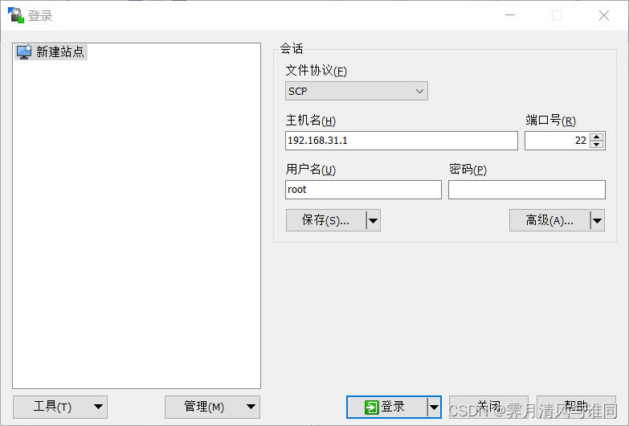

---
title: "Redmi红米路由器AC2100刷Breed教程"
date: 2023-08-10 10:00:00
tags: [红米AC2100, 路由器, Breed]
---


**忙活了一天，原本简简单单的刷Breed过程，却一直踩坑，刚开始使用常规的需Telnet的方法，但最后一直卡在反弹shell窗口，使了n多种方法始终没有解决，最后没有办法求助了一下他人，最终是用了另外一种方法完美解决问题，话不多说，接下来就开始教程，绝对是最简单的方法之一！**
# 一、开始前准备
#### （1）下载刷机工具（百度网盘，永久有效）
- 链接：[https://pan.baidu.com/s/1P4GRHPWkoaSIGt6Dq_QTOQ](https://pan.baidu.com/s/1P4GRHPWkoaSIGt6Dq_QTOQ)
- 提取码：wjl6
#### （2）路由器连接网络
- 家庭环境则拨号上网，路由器管理后台：192.168.31.1，电脑用网线与路由器连接
# 二、开启路由器ssh功能
#### （1）更改路由器原厂固件版本为：2.0.7
+ 进入路由器管理后台，找到固件升级，选择手动升级，选择文件miwifi_rm2100_firmware_d6234_2.0.7.bin进行升级
#### （2）获取stok值
+ 路由器重启后，在浏览器地址栏输入192.168.31.1，进入管理页面并登录后，地址栏链接应为：
+ http://192.168.31.1/cgi-bin/luci/;stok=**\<STOK值\>**/web/home#router

**PS: <STOK值>是代表你登录路由器管理后台后自动生成的那一长串数据，一段时间后更新，用于替换下一步中的链接中部分，拿到后尽快操作**
#### （3）漏洞注入
+ 在浏览器地址栏中输入以下链接代码，注意替换掉<STOK值>部分，否则无效：
```url
http://192.168.31.1/cgi-bin/luci/;stok=<STOK值>/api/misystem/set_config_iotdev?bssid=Xiaomi&user_id=longdike&ssid=-h%3B%20nvram%20set%20ssh_en%3D1%3B%20nvram%20commit%3B%20sed%20-i%20's%2Fchannel%3D.*%2Fchannel%3D%5C%22debug%5C%22%2Fg'%20%2Fetc%2Finit.d%2Fdropbear%3B%20%2Fetc%2Finit.d%2Fdropbear%20start%3B
```
**返回{"code":0}即代表成功！！！**
**如果返回401错误，原因可能是版本不正确或者<STOK>值错误或者链接输入不完整等，提示404错误，说明输入地址错误，请检查固件版本或链接地址**

#### （4）获取root密码

+ 等待一分钟后重启路由器，重启之后即开启ssh权限
+ 找到路由器背面的SN码，然后浏览器打开网址：

 ```url
https://miwifi.dev/ssh
 ```
- 进入后输入SN码即可拿到root密码
# 三、刷入Breed
#### （1）安装软件WinSCP
+ 打开WinSCP-5.13.4-Setup.exe进行安装
#### （2）上传breed镜像
+ 打开软件WinSCP，按图示填写，文件协议为scp,密码为刚刚获取的root密码



将breed-mt7621-xiaomi-r3g.bin文件上传到根目录下的tmp文件夹（注意是根目录下的，不是tmp文件夹下的tmp文件夹）
#### （3）刷入Breed

+ 如图所示，打开终端并输入下面指令，然后执行，等待约5分钟，此时192.168.31.1可以正常进入管理后台
 ```sh
 mtd -r write /tmp/breed-mt7621-xiaomi-r3g.bin Bootloader
```

#### （4）进入Breed控制台
+ 路由器断电，用牙签按住reset键再插电，等蓝灯闪烁，松开reset键，浏览器访问192.168.1.1即可进入breedweb界面
+ 更改环境变量，编缉,新增字段"xiaomi.r3g.bootfw",值设置为 2,然后保存。（否则刷入非原厂固件可能会出现刷入固件后重启指示灯不断蓝黑交替（无限重启）的现象）
  至此，路由器成功刷入breed。

# 总结
本文大量参考了[恩山无线论坛](https://www.right.com.cn/forum/forum.php)大佬文章内容并结合实践总结了本篇文章，由于参考文章过多在此不一一列举，请支持[恩山无线论坛](https://www.right.com.cn/forum/forum.php)。